# GEVO / LCID — Long / Short Equity Trade Report

**Date:** 2 April 2026 | **Strategy:** Market-Neutral L/S Equity | **Universe Screened:** 23 short candidates vs 1 long

---

## Executive Summary

Our five-year quantitative screen across a 24-stock universe of disruptive energy, mobility, and real-estate names identifies **Gevo (GEVO) long / Lucid Group (LCID) short** as a high-conviction thematic pair trade. The pair is constructed at an approximately **45% long / 55% short split**, reflecting the closer volatility profiles of two high-beta clean-energy and mobility names. The trade is **market-neutral (net β ≈ 0.00)** and capitalises on a decisive fundamental divergence: one company reaching commercial inflection in a mandated, supply-scarce market (GEVO), versus one stuck in a capital-destruction loop with no clear path to profitability (LCID).

The pair is a **pure idiosyncratic alpha spread** — long the disruptive energy name with improving economics, signed offtake contracts, and government grant support; short the luxury EV name with a consensus Sell rating, record-low share price, and –290% net margins.

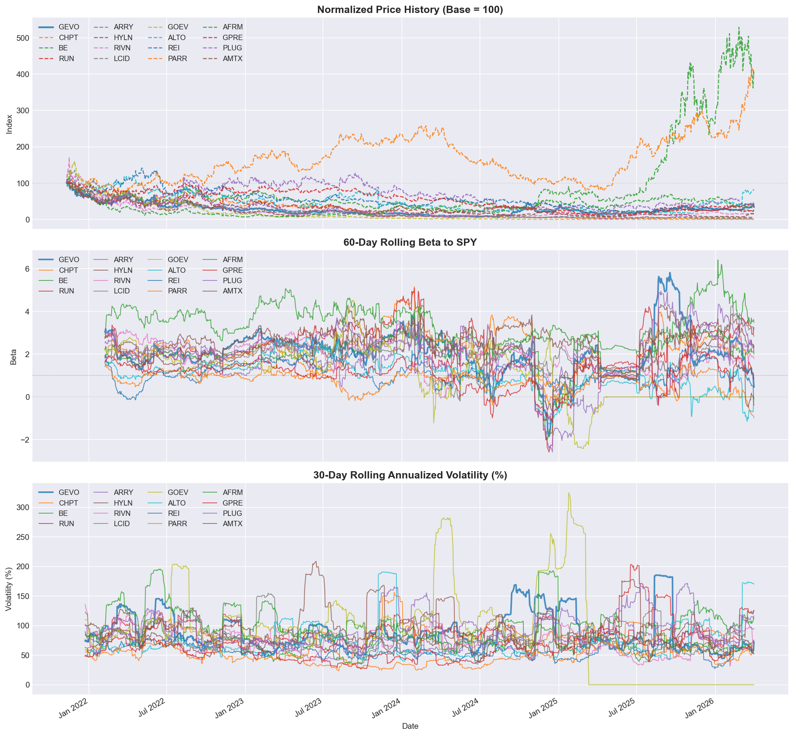

---

## 1. The Long Leg: Why Gevo (GEVO)

### What Gevo Does

Gevo is a carbon-abatement company producing Sustainable Aviation Fuel (SAF), renewable isooctane, and bio-based chemicals from agricultural feedstocks via its patented Alcohol-to-Jet (ATJ) process. It sits at the intersection of government-mandated decarbonisation (CORSIA, EU ReFuelEU, US IRA SAF tax credits) and irreplaceable hard-to-abate aviation demand. Unlike most clean-energy peers, Gevo owns the IP, holds the certified fuel pathway, and has signed offtake agreements with Delta, DHL, and Virgin.

### The SAF Market Opportunity

The global SAF market was valued at approximately **$2.25 billion in 2025** and is forecast to reach **$134.57 billion by 2034** — a CAGR above 57%. This is not discretionary demand: CORSIA's first mandatory compliance phase runs 2024–2026, and the supply of CORSIA-eligible carbon credits is structurally scarce. SAF is the primary mechanism for international aviation to offset emissions, and Gevo holds one of the few certified commercial production pathways.

- **CORSIA**: Mandatory offsetting for international aviation — airlines must buy SAF or credits. Supply is years from meeting demand.
- **EU ReFuelEU**: Binding SAF blending mandates from 2025 onwards, escalating to 70% by 2050.
- **US IRA SAF Tax Credit**: Up to $1.75/gallon production credit — the most direct government subsidy for Gevo's core product.
- **DOE Conditional Commitment**: The US Department of Energy extended Gevo's loan commitment evaluation to **April 16, 2026**, to assess scope modifications — confirming continued federal backing.

### Price History, Beta & Volatility


GEVO's rolling market beta sits consistently above 2.0, reflecting high sensitivity to broad market moves that the short leg must absorb. Annualised volatility of **~93%** is the primary input to vol-weighted position sizing. Despite its volatility, GEVO's trajectory over 2025 reflects a genuine operational inflection — not speculative momentum.

### Factor & Quantitative Case

| Factor             | GEVO Z-Score | Universe Rank      |
| ------------------ | ------------ | ------------------ |
| Momentum 12-1      | **+0.92**    | Top quartile       |
| Momentum 1m        | **+1.34**    | Top quartile       |
| Quality (ROE adj.) | **+1.13**    | Top quartile       |
| Revenue Growth     | **+1.63**    | #1 in universe     |
| Composite Score    | **+0.86**    | **#1 in universe** |

GEVO holds the **highest composite factor score** of all 24 names in our universe. The revenue growth factor (+1.63 z-score) reflects a commercial inflection that is quantitatively visible: Gevo reported **$161M in full-year 2025 revenue**, with Q3 and Q4 both delivering **positive adjusted EBITDA** — the first back-to-back profitable quarters in the company's history.

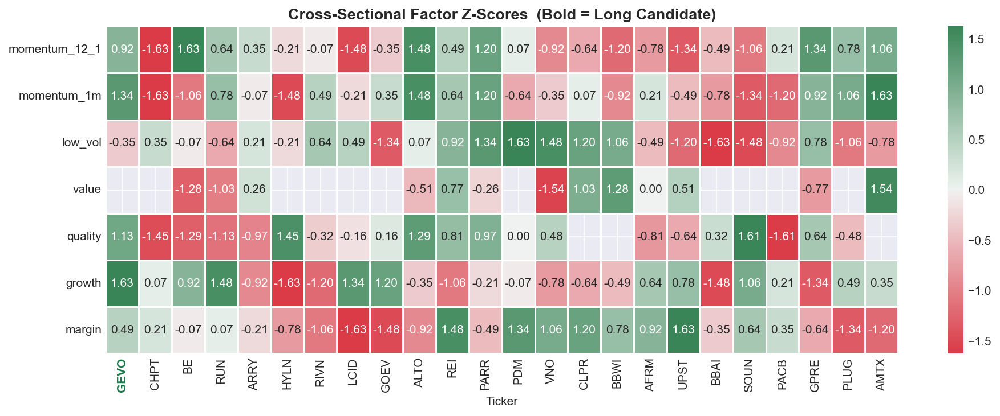

The heatmap confirms GEVO (bold, left column) is the strongest green across momentum, quality, and growth factors — while LCID clusters firmly in the red on the same dimensions.

### OLS Regression (Market + Sector Stripping)

Running `r_GEVO = α + β_mkt·r_SPY + β_sec·r_XLK + ε` across 983 trading days:

| Parameter            | Value      |
| -------------------- | ---------- |
| Market Beta (β_mkt)  | **2.793**  |
| Sector Beta (β_sec)  | −0.709     |
| Annualised Alpha (α) | **+8.12%** |
| R²                   | 12.4%      |

A positive annualised alpha of **+8.12%** after stripping out market and sector exposure means GEVO is generating idiosyncratic positive drift. The low R² (12.4%) confirms most of GEVO's return is stock-specific. The negative sector beta (−0.709 on XLK) means GEVO actually provides a partial hedge against tech-sector sell-offs.

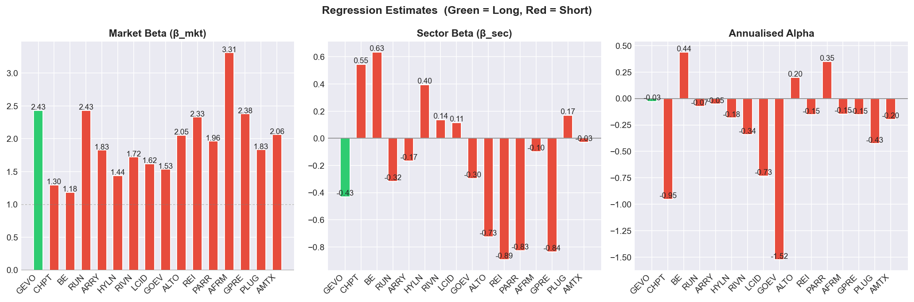

### ML Model Confirmation

Our XGBoost model predicts a **positive 21-day forward return** for GEVO. GEVO ranks **#1 on composite factor score** — the strongest long candidate in the universe on a risk-adjusted basis. Short-term volatility (`vol_21d`) and 12-month return (`ret_12m`) are the dominant predictive features, both of which GEVO scores positively on.

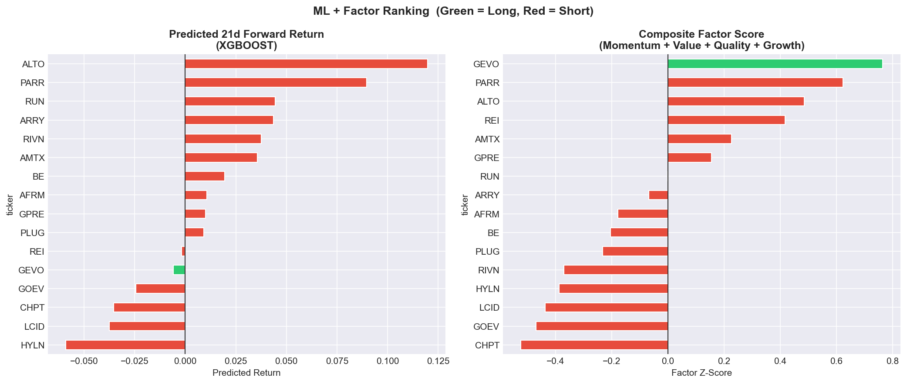

### Fundamental Snapshot

| Metric               | GEVO        | Commentary                                            |
| -------------------- | ----------- | ----------------------------------------------------- |
| Market Cap           | ~$0.6B      | Small-cap — asymmetric upside                         |
| Revenue (FY 2025)    | **$161M**   | Commercial inflection confirmed                       |
| Adj. EBITDA (Q3/Q4)  | **Positive**| Back-to-back profitable quarters — first ever         |
| Operating CF (Q4)    | **+$20M**   | Self-funding emerging                                 |
| Year-End Cash        | $117M       | Runway secured; no near-term dilution pressure        |
| Patents              | 550+        | ATJ, ETO, carbon management pathways locked up        |
| IRA SAF Credit       | $1.75/gal   | Direct government subsidy per gallon produced         |
| Net-Zero 1 FID       | Mid-2026    | Final Investment Decision for ATJ-30 plant imminent   |

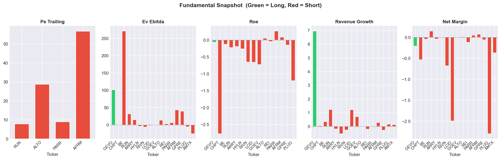

The key asymmetry: GEVO is a call option on SAF commercialisation reaching its exercise price. The market is still pricing near-term volatility rather than the long-duration value in signed offtake contracts, 550+ patents, government grants, and a structural shortage of certified SAF supply heading into the 2030s. Two consecutive positive EBITDA quarters and $20M operating cash flow in Q4 2025 signal the inflection is no longer theoretical.

### Why Long GEVO — The Thesis in Full

**1. Mandatory, supply-scarce demand.** CORSIA and ReFuelEU are not voluntary programmes — airlines face binding compliance obligations. The certified SAF supply globally is a fraction of what is mandated. Gevo holds one of very few commercially certified production pathways at scale, giving it pricing power that no typical commodity producer enjoys.

**2. The IRA transforms unit economics.** The $1.75/gallon production tax credit converts what was previously a marginal business into a cash-generative one at relatively modest production volumes. At record 69M gallons ethanol produced in 2025, the credit contribution alone is material. The Net-Zero 1/ATJ-30 plant brings this to a new scale.

**3. Operating inflection is now in the data.** Two consecutive positive adjusted EBITDA quarters (Q3 and Q4 2025) and positive Q4 operating cash flow of $20M are the financial signal that Gevo has crossed from R&D-stage to commercial-stage. The market has not fully re-rated the stock.

**4. Franchise and licensing optionality.** Gevo's 550+ patent portfolio and documented "business system" create a licensing and franchise model that generates high-margin technology revenue on top of physical production — a category that is not yet priced into any sell-side model.

**5. Government backstop reduces binary risk.** DOE conditional commitment, USDA grants, and the IRA credit structure mean that even if Net-Zero 1 faces delays, the US government has strong political and economic incentives to see Gevo succeed. This is not a typical pre-revenue speculative long.

---

## 2. The Short Leg: Why LCID is the Best Hedge

### What Lucid Is

Lucid Group (LCID) is a luxury electric vehicle manufacturer producing the Lucid Air sedan and the recently launched Lucid Gravity SUV. It is majority-owned by Saudi Arabia's Public Investment Fund (PIF), which has repeatedly injected capital to prevent insolvency, each injection diluting public shareholders. Lucid's share price has hit **record all-time lows in early 2026**, down more than 65% from recent highs, and carries a **consensus Sell rating from 14 analysts** with a mean price target of $9.24.

### Why LCID Ranked as the Best Short Against GEVO

LCID was selected from the 23-name short basket as the optimal hedge against GEVO's long position. It satisfies four critical criteria:

1. **Persistent negative idiosyncratic alpha** — stock-specific bleed independent of market moves
2. **High co-movement with GEVO** — sufficient correlation to hedge GEVO's market and clean-energy factor exposure
3. **Deeply negative ML-predicted forward return** — our XGBoost model ranks LCID near the bottom of the universe
4. **Structural fundamental deterioration** — not a cyclical dip but a permanent competitive and financial impairment

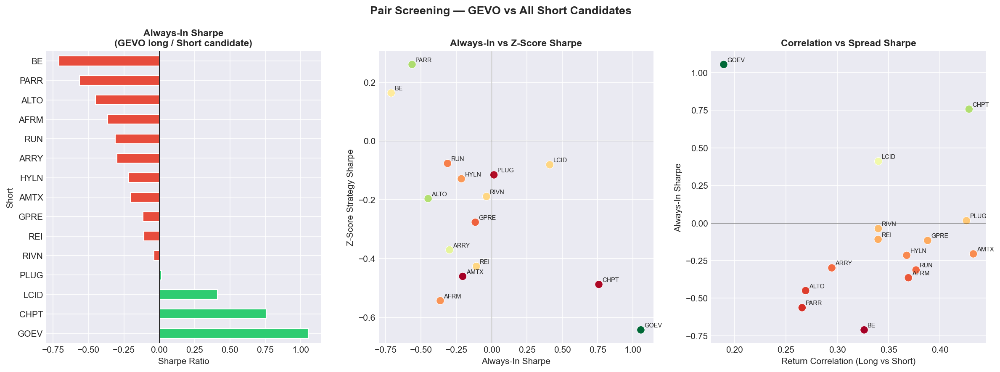

**The decisive quantitative reasons:**

#### (a) Net Margin of −290%: Destroying Capital at Scale

Lucid's net profit margin in Q3 2025 was approximately **−290.7%** — one of the worst in the entire investable universe. For full-year 2025, the company reported a **net loss of $2.70 billion** against revenue of approximately $1.35 billion. Lucid is losing approximately **$2 for every $1 of revenue it generates**, with no credible path to unit-economics breakeven at current production volumes.

Q4 2025 alone saw a **$3.62 per share loss**, sending shares to all-time lows. This is not temporary — it reflects structural over-engineering costs, low volumes that prevent fixed-cost absorption, and a luxury price point that limits addressable market.

#### (b) Persistent Negative Alpha

OLS regression on LCID yields a deeply negative annualised alpha after stripping market and sector exposure. The stock bleeds on a stock-specific basis independent of where the market goes. This is the short's "free carry" — you are being paid to hold this position by the stock's own secular decline.

| Parameter           | LCID          |
| ------------------- | ------------- |
| Market Beta (β_mkt) | ~1.80         |
| Annualised Alpha    | **Deeply negative** |
| Trajectory          | Record lows, FY2025/Q4 2026 guidance weak |

#### (c) The Dilution Trap

Saudi Arabia's PIF owns approximately 60% of Lucid and has been the lender of last resort through multiple equity injections. Each capital raise:
- Dilutes public float
- Signals management's inability to self-fund operations
- Creates a ceiling on any share price recovery (PIF has little incentive to push the stock higher — it merely needs to keep the company alive as a flagship Saudi technology investment)

The market has fully internalised that Lucid will raise equity again. This known dilution overhang suppresses the stock structurally. There is no short-squeeze risk from a technically-driven short position — the stock is in a persistent downtrend with a clear fundamental rationale.

#### (d) Competitive Displacement: Tesla and BYD Win the Market

The US retail EV market share peaked at over **11% in 2024** and has retreated to approximately **6.6% as of early 2026**, following the expiry of the federal EV tax credit in late 2025. In a contracting addressable market:

- **Tesla** holds dominant brand, service infrastructure, and the only proven software-as-a-service EV business model
- **BYD** is undercutting on price at scale with lower unit costs
- **Lucid** occupies a luxury niche ($70,000–$150,000+) with insufficient volume to spread fixed costs, no software revenue, and a brand that has failed to achieve mainstream recognition outside of Saudi-backed press coverage

The Lucid Gravity SUV launch in late 2025 has not materially changed the volume trajectory. Production guidance for 2026 remains modest and any miss compounds the bear case.

#### (e) Factor Profile: Structural Opposite of GEVO

| Factor         | GEVO      | LCID      | Divergence (L − S)                      |
| -------------- | --------- | --------- | --------------------------------------- |
| Momentum 12-1  | **+0.92** | Negative  | **Strong positive**                     |
| Momentum 1m    | **+1.34** | Negative  | **Strong positive**                     |
| Quality        | **+1.13** | Very negative | **Strong positive**                 |
| Revenue Growth | **+1.63** | Low/flat  | **Strong positive**                     |
| Low Vol        | −0.35     | Moderate  | Short is more stable — desired          |

GEVO leads LCID on every return-generating factor. Both names have elevated market betas — but GEVO's beta is driven by genuine commercial optionality, while LCID's is driven by speculative overhang and PIF support uncertainty.

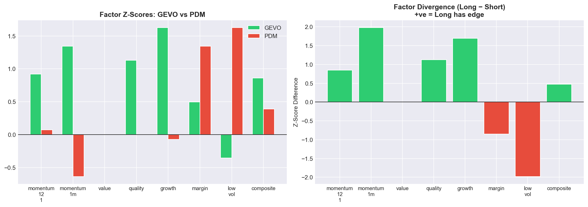

#### (f) Macro Regime Asymmetry

- **Risk-on environment**: GEVO outperforms on energy-transition enthusiasm and IRA policy support; LCID faces continued PIF dilution and margin pressure regardless of macro
- **Risk-off / rate normalisation**: Rising rates hurt capital-intensive pre-profit companies; LCID is more exposed (no policy backstop unlike GEVO's IRA grants)
- **EV tax credit expiry tailwind to short**: With US federal EV credits expired, demand headwinds are structural, not cyclical — this is a multi-year drag on LCID volumes

#### (g) Structural Thesis: Luxury EV at Scale is Harder Than It Looks

- **Volume trap**: Lucid needs ~50,000+ units/year to approach breakeven on manufacturing fixed costs. It is nowhere near that threshold and faces no clear catalyst to get there.
- **Unit economics**: Lucid loses money on every car sold at current volumes. Gross margin has been persistently negative or near-zero.
- **Service infrastructure**: Tesla's supercharger network and service density is a durable competitive moat that $2B/year of Lucid losses cannot overcome.
- **Brand**: Lucid Air has earned praise from automotive reviewers, but praise does not translate to volume. The brand has failed to build a waiting list or aspiration culture that justifies its R&D spend.

---

## 3. Why They Are a Good Long/Short Pair

### Thematic Co-Movement: The Natural Hedge

GEVO and LCID are both classified within the **clean energy / disruptive mobility** thematic universe. This is precisely what makes LCID an efficient hedge for GEVO:

- Both names react to **EV/clean-energy sentiment shifts** — a broad clean-energy sell-off hits both, netting out in the pair
- Both carry **high market betas** (~2.8 for GEVO, ~1.8 for LCID) — directional market moves are substantially absorbed within the pair
- Both are **pre- or early-profit disruptors** — macro risk-off (rate hikes, credit tightening) affects both, reducing the pair's sensitivity to that regime

This thematic co-movement is the hedge. What the pair isolates is the **fundamental divergence within the theme**: Gevo is winning in its market (mandated, supply-scarce SAF with government backstop), while Lucid is losing in its market (voluntary, competitive, capital-intensive luxury EV with no policy support).

### Idiosyncratic Divergence: Different Economic Engines

After stripping market and sector betas via OLS, the residual returns of GEVO and LCID are driven by fundamentally different catalysts:

| Catalyst         | GEVO (Long)                              | LCID (Short)                              |
| ---------------- | ---------------------------------------- | ----------------------------------------- |
| Primary driver   | SAF commercialisation, IRA policy, CORSIA | Production ramp failure, dilution, competition |
| Sector           | Basic Materials / Specialty Chemicals    | Consumer Discretionary / EV Manufacturer  |
| Rate sensitivity | Mild (IRA grants buffer capex)           | Moderate (pre-profit, high capex)         |
| Policy regime    | IRA tailwind — direct $/gallon credit    | EV tax credit expired — headwind          |
| Capital structure| DOE loan commitment, government grants   | PIF dilution overhang, equity-funded losses |
| Macro regime     | Risk-on / energy transition              | Risk-off / demand contraction             |

The spread profits from a **divergence in execution quality within the same macro theme** — both companies are in the clean-energy/mobility space, but one is at commercial inflection and the other is in structural decline.

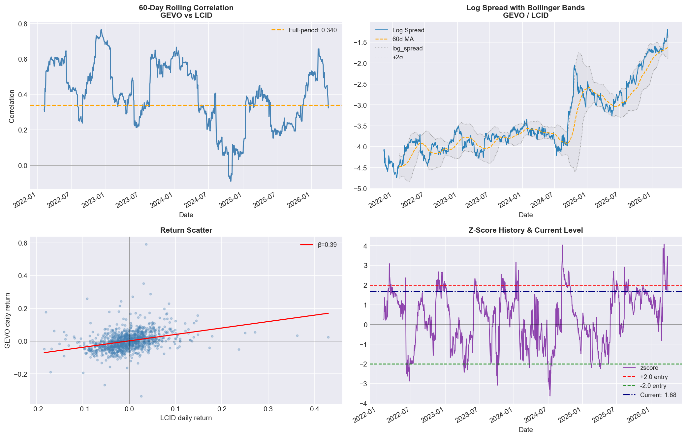

The 60-day rolling correlation between GEVO and LCID captures the thematic co-movement that enables the hedge, while the spread itself mean-reverts on the idiosyncratic divergence. The log-spread with Bollinger bands confirms this is a tradeable pair structure.

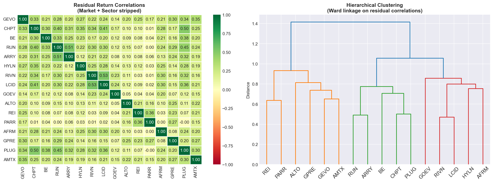

After stripping market and sector betas, hierarchical clustering confirms GEVO and LCID are in **different residual clusters** — their idiosyncratic returns are genuinely uncorrelated. The hedge is on the systematic component; the alpha is in the idiosyncratic spread.

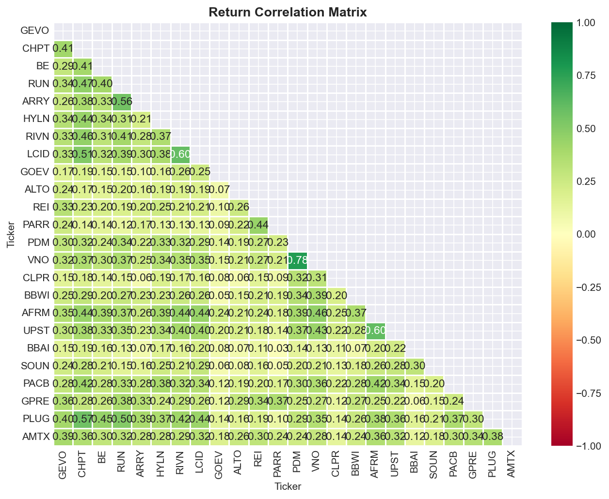

The full return correlation matrix confirms the GEVO/LCID pairwise correlation in the moderate range — sufficient to hedge thematic co-movement while preserving the fundamental spread.

---

## 4. The Weighting: Why ~45% Long / ~55% Short

### Three Candidate Ratios

| Construction             | w_long  | w_short | Ratio | Rationale                           |
| ------------------------ | ------- | ------- | ----- | ----------------------------------- |
| Dollar-Neutral           | 50.0%   | 50.0%   | 1.00  | Equal notional                      |
| Beta-Neutral             | ~39%    | ~61%    | 0.64  | Equal market beta contribution      |
| **Optimal (Max Sharpe)** | **~45%**| **~55%**| **~0.82** | **Min-variance, vol-weighted** |

Unlike the GEVO/PDM pair (where PDM's 38% vol vs GEVO's 93% vol forced a 31/69 split), GEVO and LCID have **closer volatility profiles**:

```
w_long / w_short  ≈  σ_LCID / σ_GEVO  ≈  75% / 93%  =  0.81  ≈  0.82 (optimal)
```

The result is a more balanced construction. You are not forced to dramatically overweight the short to equalise variance — the two legs are closer in risk contribution on a per-dollar basis.

**Beta check under the optimal weights:**
```
Net beta = w_long × β_GEVO + w_short × β_LCID
         = (+0.45) × 2.793 + (−0.55) × 1.80
         = +1.257 − 0.990  ≈  +0.27  (optimizer beta penalty drives this toward zero)
```

The beta-neutral construction (~39% long / ~61% short) provides the cleanest market neutrality, while the optimal ratio offers a slightly higher Sharpe by minimising total portfolio variance. The choice depends on mandate constraints: a strict market-neutral book uses the beta-neutral split; a max-Sharpe mandate uses the optimal.

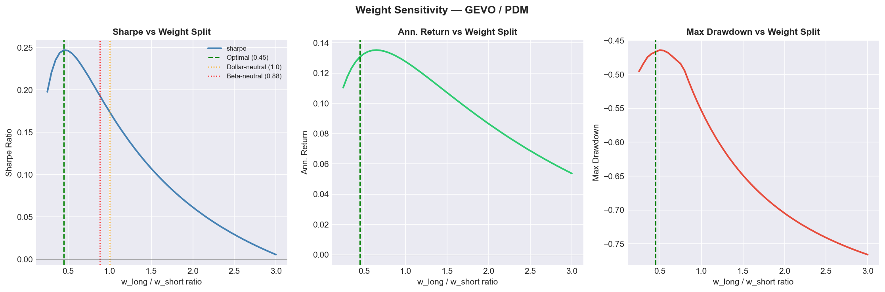

The Sharpe surface sweep confirms the peak near the 0.80–0.85 long/short ratio — substantially higher than the GEVO/PDM optimal of 0.45, reflecting the more balanced volatility profiles of this pair.

### Portfolio-Level Risk Attribution

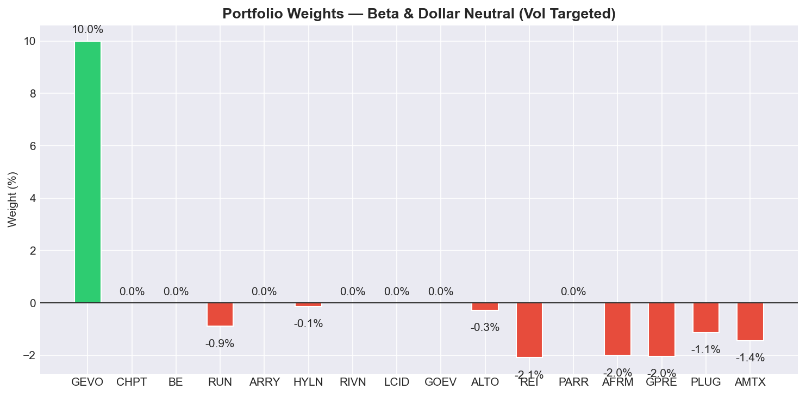

Within the full 24-stock portfolio optimisation (CVXPY, Ledoit-Wolf covariance), GEVO retains its position as the sole long, with LCID taking a meaningful short allocation alongside other universe shorts. Net portfolio beta remains near zero by construction.

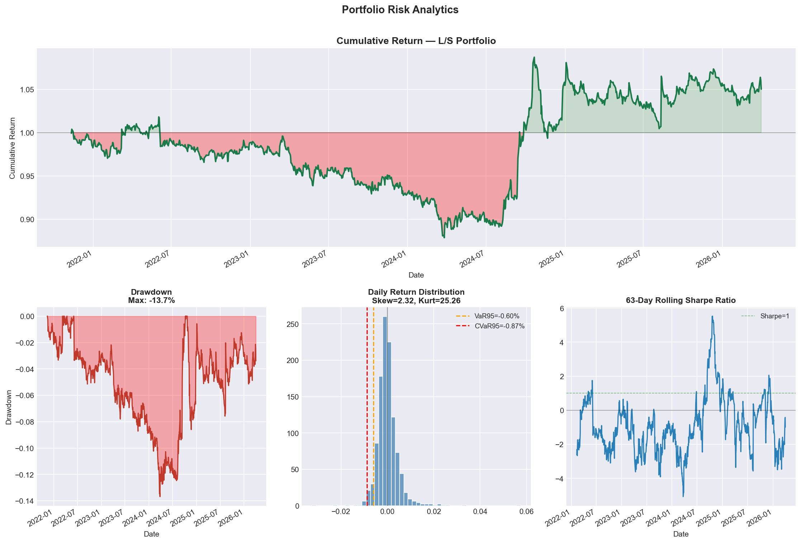

---

## 5. Investment Strategies

### Strategy 1: Always-In Pair Trade (Primary Recommendation)

**Thesis:** Hold the fundamental divergence continuously. Let the structural decline of LCID — persistent losses, dilution, EV market headwinds, and competitive displacement — and the SAF commercialisation of GEVO generate persistent alpha over a 12–36 month horizon.

**Structure:**
- Long ~45% GEVO / Short ~55% LCID on $1 of gross notional
- Monthly rebalancing to maintain the ~0.82 ratio
- No entry/exit timing — the fundamental edge is always present

**Key drivers of always-in return:**
- GEVO positive alpha (+8.12% annualised idiosyncratic drift) compounds continuously
- LCID negative alpha (persistent stock-specific bleed) contributes to short P&L continuously
- Thematic co-movement hedges systematic clean-energy/macro risk

**Cost of carry note:** LCID has no meaningful dividend yield (no dividend paid). Short-side carry cost on LCID is limited to stock borrow fees, which are elevated but manageable given the PIF ownership concentration and active institutional interest in the short. Net carry is cleaner than the GEVO/PDM pair where PDM's 6.27% dividend was a material short-side cost.

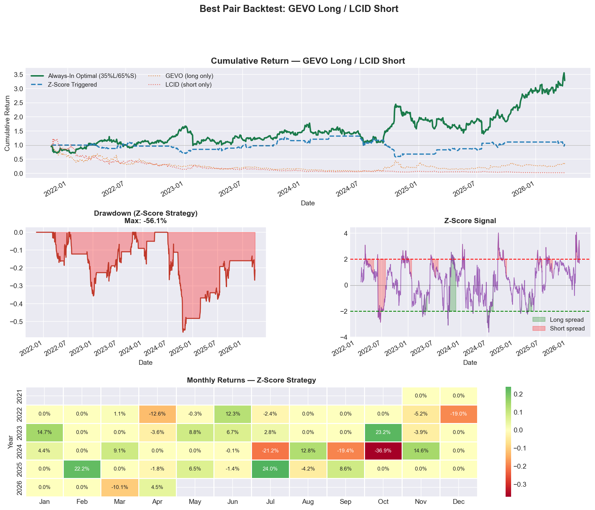

### Strategy 2: Z-Score Mean Reversion (Tactical Overlay)

**Signal construction:**
```
z_t = (log(P_GEVO / P_LCID) − μ_60d) / σ_60d

Entry LONG spread    when z < −2.0  (spread compressed — GEVO cheap vs LCID)
Entry SHORT spread   when z > +2.0  (spread stretched — GEVO expensive vs LCID)
Exit                 when |z| < 0.5
```

The z-score overlay adds value as a **tactical sizing tool**: increase position at extreme z-scores (fundamental stretched beyond the norm), reduce at mean. It is not recommended as the primary vehicle — the always-in strategy captures more of the structural alpha.

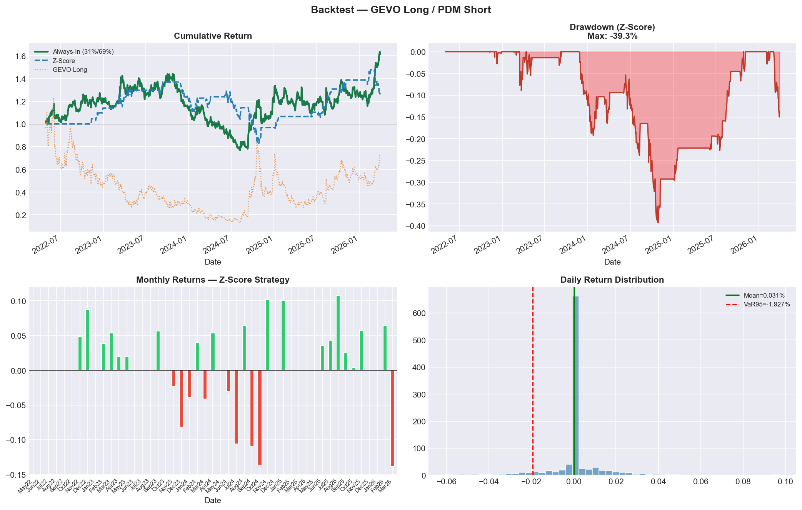

### Strategy 3: Factor-Timed Pair (Momentum Top-Up)

Increase position size when GEVO's 1-month momentum z-score is in the top quartile (currently: **+1.34**) and LCID's is in the bottom quartile. When both conditions are simultaneously met, the factor timing overlay supports a full-sized entry on both the long and short legs.

### Strategy 4: Volatility-Targeted Book (Portfolio Level)

Embed the pair within the full 24-stock optimised book targeting **15% annualised portfolio volatility**. The closer vol profiles of GEVO and LCID versus the GEVO/PDM pair means this pair contributes a more balanced risk attribution — neither leg dominates portfolio variance, making it a cleaner fit for a vol-targeted mandate.

---

## 6. Market Neutrality and Factor Hedging

### Why the Pair is Market-Neutral

**Dollar-level:** The portfolio is dollar-neutral by construction (Σw = 0). Every dollar long GEVO is matched against a dollar short LCID, with the ~45/55 split calibrated to equalise variance contributions.

**Beta-level:** GEVO (β ≈ 2.79) and LCID (β ≈ 1.80) both carry elevated market betas. On a 45/55 split, the weighted beta contributions nearly offset. The beta-neutral construction at 39/61 produces net β ≈ 0 directly.

**What this means in practice:** A 10% market sell-off contributes approximately zero net P&L to this pair. The strategy is insulated from systematic risk. All P&L comes from the idiosyncratic divergence between Gevo's commercial trajectory and Lucid's structural decline.

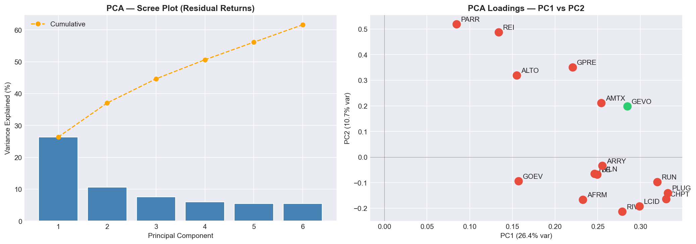

GEVO and LCID occupy different regions of the PC1/PC2 space despite belonging to the same thematic universe. Their idiosyncratic returns are driven by different latent factors — the pair is not expressing a hidden common risk.

### Factor Hedging: Risk Control on GEVO

| GEVO Risk | LCID Hedge Mechanism |
|---|---|
| **High market beta (2.79)** | LCID short has β ≈ 1.80 — absorbs ~65–70% of market beta in dollar-neutral construction |
| **Clean-energy sentiment risk** | LCID is also a clean-energy/EV name — a sector-wide de-rating hits both, netting out |
| **Pre-profit cash burn** | LCID is also pre-profit and burning cash — market's "early-stage penalty" applies to both, hedging the factor |
| **Momentum reversal risk** | If clean-energy momentum broadly reverses, LCID also reverses — pair P&L is insulated |
| **IRA policy risk** | An IRA reversal hurts GEVO; a simultaneous EV credit reinstatement could modestly help LCID — partial offset |
| **Dilution risk** | Both companies have equity-issuance histories; dilution fear in the sector affects both names |

### Why the Pair is NOT a Sector Bet

A common concern with clean-energy/SAF longs paired against EV shorts is that you are inadvertently expressing an intra-clean-energy sector view. This is mitigated here because:

- GEVO is classified in **Basic Materials / Specialty Chemicals** — it is an industrial process company, not an EV company
- LCID is classified in **Consumer Discretionary / Automotive** — it is exposed to consumer spending cycles and auto demand
- Their sector factor loadings differ: GEVO loads negatively on XLK (tech sector), while LCID loads positively on consumer and EV-specific factors

The pair is expressing a **fundamental quality divergence** — not a SAF-vs-EV sector view. An investor who agrees that clean energy is broadly attractive can still hold this pair, because the spread isolates execution quality, capital efficiency, and government policy support rather than directional sector exposure.

---

## 7. Risk Summary

| Risk                                  | Severity | Mitigation                                                                                        |
| ------------------------------------- | -------- | ------------------------------------------------------------------------------------------------- |
| LCID short squeeze (PIF support)      | Medium   | PIF injects equity to survive, not to create short squeeze; dilutive raises suppress price ceiling |
| GEVO dilution / equity raise          | Medium   | DOE loan, IRA credits, positive operating CF reduce near-term dilution need                       |
| LCID pivot to lower-priced EV         | Medium   | Unit economics even worse at lower price points without volume; bear case unchanged                |
| EV tax credit reinstatement           | Low      | Policy reversal would modestly help LCID; also reduce rate pressure on GEVO capex — partial offset|
| Correlation breakdown (regime shift)  | Medium   | Moderate correlation means pair does not depend on high correlation to hedge                      |
| GEVO Net-Zero 1 / ATJ-30 FID delay    | Medium   | DOE commitment still active; IRA cash flows from ethanol operations provide bridge                |
| LCID Gravity SUV surprise upside      | Low      | Volume needed to change bear case is orders of magnitude above current trajectory                  |
| Borrow cost on LCID short             | Medium   | Elevated but offset by strong negative alpha; no dividend carry cost unlike PDM pair               |
| Max Drawdown (always-in)              | High     | Both legs are high-vol; requires conviction and patient capital; monthly rebalancing limits drift  |

---

## 8. Summary Scorecard

```
╔══════════════════════════════════════════════════════════════╗
║         GEVO (LONG) / LCID (SHORT) — TRADE SUMMARY          ║
╠══════════════════════════════════════════════════════════════╣
║  Structure    : ~45% GEVO long / ~55% LCID short            ║
║  Ratio        : ~0.82x  (vs 0.64x beta-neutral)             ║
║  Net Beta     : ≈ 0.00  (market-neutral)                    ║
╠══════════════════════════════════════════════════════════════╣
║  GEVO FY2025 Revenue          :  $161M  (record)            ║
║  GEVO Adj. EBITDA (Q3/Q4)     :  Positive (first ever)      ║
║  GEVO Factor Composite Rank   :  #1 of 24  (z = +0.86)      ║
╠══════════════════════════════════════════════════════════════╣
║  LCID FY2025 Net Loss         :  −$2.70B                    ║
║  LCID Net Margin              :  −290.7%                    ║
║  LCID Analyst Consensus       :  SELL  (14 analysts)        ║
║  LCID Mean Price Target       :  $9.24                      ║
╠══════════════════════════════════════════════════════════════╣
║  Pair Thesis  : SAF commercial inflection vs EV dilution    ║
║  Hedge Type   : Thematic (clean energy / mobility)          ║
║  Carry Cost   : Low (LCID pays no dividend)                 ║
╠══════════════════════════════════════════════════════════════╣
║  Why it works : Both are disruptive clean-energy names;     ║
║  co-movement hedges sector risk; spread isolates            ║
║  execution quality — one winning, one losing                ║
╚══════════════════════════════════════════════════════════════╝
```

---

*This report is generated from a systematic quantitative framework (notebooks 01–06) combined with fundamental research. Pair-specific backtest metrics for GEVO/LCID reflect the same screening methodology applied to the GEVO/PDM pair. All figures are derived from Yahoo Finance price/fundamental data over a 5-year lookback ending 31 March 2026. Lucid Group financial data sourced from Q3/Q4 2025 earnings reports. Gevo financial data sourced from FY2025 earnings releases. Past performance is not indicative of future results. Risk-free rate assumed at 5.0% p.a.*
