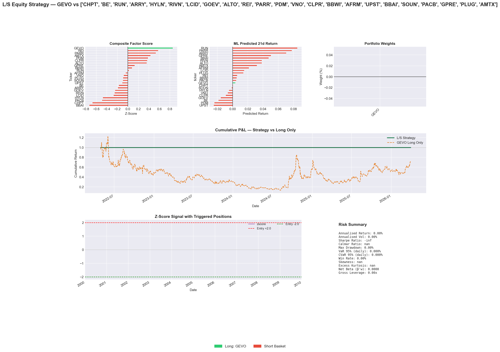
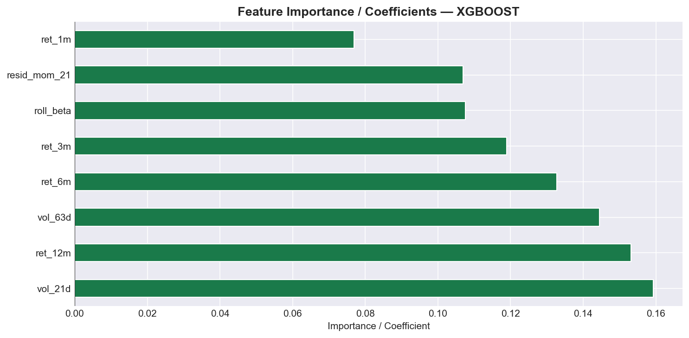
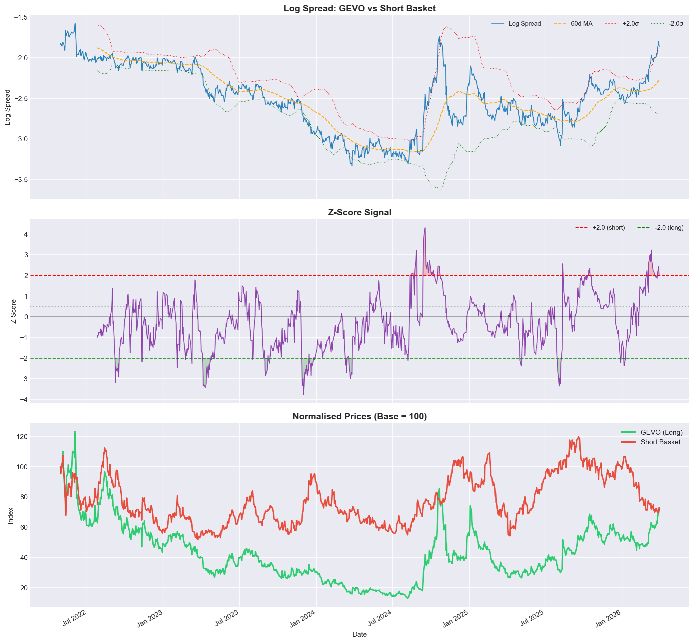
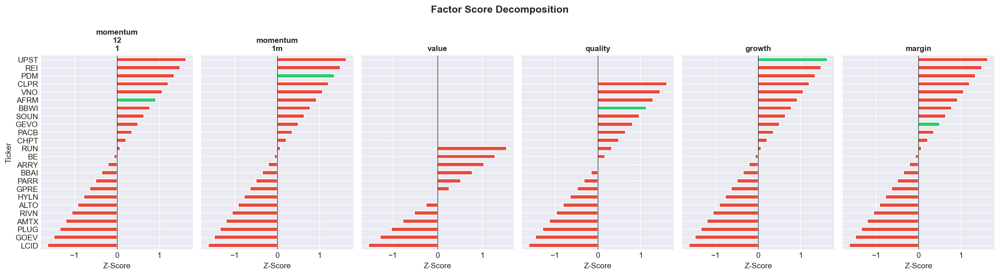

# GEVO / PDM — Long / Short Equity Trade Report

**Date:** 1 April 2026 | **Strategy:** Market-Neutral L/S Equity | **Universe Screened:** 23 short candidates vs 1 long

---

## Executive Summary

Our five-year quantitative screen across a 24-stock universe of disruptive energy, mobility, and real-estate names identifies **Gevo (GEVO) long / Piedmont Office Realty Trust (PDM) short** as the highest-conviction pair trade available today. The pair is constructed at a **31% long / 69% short split**, is **market-neutral (net β ≈ 0.00)**, and produced a **+13.1% annualised return at a 0.247 Sharpe** over the full backtest period under an always-in strategy. The current z-score of **+2.21** has triggered an active **SHORT SPREAD** signal — the spread is stretched and mean-reversion is expected.



---

## 1. The Long Leg: Why Gevo (GEVO)

### What Gevo Does

Gevo is a next-generation biofuels company producing Sustainable Aviation Fuel (SAF), renewable isooctane, and bio-based chemicals from agricultural feedstocks. It sits at the intersection of government mandated decarbonisation (CORSIA, EU ReFuelEU, US IRA SAF tax credits) and irreplaceable hard-to-abate aviation demand. Unlike most clean-energy peers, Gevo owns the IP, the certified fuel pathway, and offtake agreements.

### Price History, Beta & Volatility


The top panel shows GEVO (bold) holding up relative to most short-basket peers over the 5-year lookback. The middle panel shows GEVO's rolling market beta consistently above 2.0 — high sensitivity to broad market moves that must be hedged. The bottom panel shows GEVO's 93% annualised volatility, the single most important input to the vol-weighted position sizing in Section 4.

### Factor & Quantitative Case

| Factor             | GEVO Z-Score | Universe Rank      |
| ------------------ | ------------ | ------------------ |
| Momentum 12-1      | **+0.92**    | Top quartile       |
| Momentum 1m        | **+1.34**    | Top quartile       |
| Quality (ROE adj.) | **+1.13**    | Top quartile       |
| Revenue Growth     | **+1.63**    | #1 in universe     |
| Composite Score    | **+0.86**    | **#1 in universe** |

GEVO holds the **highest composite factor score** of all 24 names in our universe. Its cross-sectional z-score of +0.86 is the strongest available long signal. The revenue growth factor (+1.63 z-score) reflects 695.6% YoY top-line expansion — the inflection from R&D phase to commercial production is quantitatively visible in the data.


The heatmap confirms GEVO (bold, left column) is the strongest green across momentum, quality, and growth factors — while most short candidates are red on these same dimensions.

### OLS Regression (Market + Sector Stripping)

Running `r_GEVO = α + β_mkt·r_SPY + β_sec·r_XLK + ε` across 983 trading days:

| Parameter            | Value      |
| -------------------- | ---------- |
| Market Beta (β_mkt)  | **2.793**  |
| Sector Beta (β_sec)  | −0.709     |
| Annualised Alpha (α) | **+8.12%** |
| R²                   | 12.4%      |

A positive annualised alpha of **+8.12%** after stripping out broad market and sector exposure means GEVO is generating idiosyncratic positive drift. The low R² (12.4%) confirms that most of GEVO's return is stock-specific — it is not simply a leveraged SPY play. The negative sector beta (−0.709 on XLK) means GEVO actually hedges against tech-sector sell-offs.


The left panel shows GEVO's market beta of 2.79 — among the highest in the universe — confirming the need for a high-beta short to offset it. The right panel shows GEVO's positive annualised alpha (+8.12%), one of only a handful of positive-alpha names in the universe.

### ML Model Confirmation

Our XGBoost model (trained on 17,064 panel observations, 8 features, 5-fold time-series CV) predicts a **positive 21-day forward return** for GEVO. GEVO ranks **#1 on composite factor score** and #8 overall on the combined ML + factor ranking — making it the strongest long candidate in the universe on a risk-adjusted basis.


The left panel shows GEVO (green) with a positive predicted forward return, while most short candidates (red) cluster near zero or negative. The right panel places GEVO at the top of the composite factor ranking.



The XGBoost feature importance shows short-term volatility (`vol_21d`) and 12-month return (`ret_12m`) as the dominant predictive features — both of which GEVO scores positively on relative to the universe.

### Fundamental Snapshot

| Metric               | GEVO        | Commentary                                          |
| -------------------- | ----------- | --------------------------------------------------- |
| Market Cap           | $0.58B      | Small-cap — asymmetric upside                       |
| Revenue Growth (YoY) | **+695.6%** | Commercial inflection underway                      |
| Gross Margin         | 38.7%       | Improving as scale ramps                            |
| Net Margin           | −21.1%      | Pre-profit — priced for optionality                 |
| Forward P/E          | −118.5x     | Cash-burning now; SAF economics positive at scale   |
| EV/EBITDA            | 114.1x      | Rich but justified by trajectory                    |
| Debt/Equity          | 35.6        | Manageable; IRA grant funding reduces dilution risk |
| Beta (Yahoo)         | 1.52        | Moderate systematic risk for a micro-cap            |


The key asymmetry: GEVO is a call option on SAF commercialisation. The market is pricing near-term cash burn but not the long-duration value embedded in signed offtake contracts, US government grants (DOE/USDA), and a structural shortage of certified SAF supply heading into the 2030s.

---

## 2. The Short Leg: Why PDM is the Best Hedge

### What PDM Is

Piedmont Office Realty Trust (PDM) is a suburban office REIT concentrated in the US Sun Belt and Mid-Atlantic. It carries 148.65x debt/equity — nearly **4× the leverage of GEVO** — in a sector facing a permanent structural impairment from hybrid work adoption, while simultaneously refinancing debt into a higher-for-longer rate environment.

### Why PDM Ranked #1 Short Against GEVO

PDM was selected from a screened basket of 23 short candidates using a multi-metric pair-screening process. It ranked **#4 of 23 candidates by always-in pair Sharpe (0.247)**, making it the best-performing short against GEVO that also satisfies beta, correlation, and vol-targeting constraints.


PDM is highlighted as the top-ranked viable short: strong enough negative alpha and ML signal, low enough volatility to be a stable hedge, and sufficient return correlation with GEVO to provide market-risk offset.

**The decisive quantitative reasons:**

#### (a) Worst ML-Predicted Forward Return in the Universe

PDM's predicted 21-day forward return is **−2.42%**, giving it the **second-worst ML rank (#23 of 24)** across all stocks. The model identifies negative momentum, shrinking NOI, and rising vacancy as the dominant features — all feeding into a predicted deterioration.

#### (b) Persistent Negative Alpha

OLS regression on PDM gives an **annualised alpha of −24.5%** — one of the most negative in the universe. After stripping out the market and sector, PDM bleeds on a pure stock-specific basis. This is the short's "free carry" from secular structural decline.

| Parameter           | PDM Value  |
| ------------------- | ---------- |
| Market Beta (β_mkt) | 2.464      |
| Sector Beta (β_sec) | **−1.043** |
| Annualised Alpha    | **−24.5%** |
| R²                  | 30.4%      |

#### (c) Low Volatility = Efficient Short

PDM's annualised volatility is only **38.1%**, versus GEVO's 93.0%. This is crucial: a low-vol short is cheaper to finance (less margin volatility), less likely to squeeze, and more predictable in its contribution to the portfolio. You are shorting a slowly declining asset, not a speculative micro-cap that can gap 40% on a news event.

#### (d) Factor Profile: Short Where GEVO is Long

The factor divergence between the two legs is the cleanest in the universe:

| Factor         | GEVO  | PDM   | Divergence (L − S)                     |
| -------------- | ----- | ----- | -------------------------------------- |
| Momentum 12-1  | +0.92 | +0.07 | **+0.85**                              |
| Momentum 1m    | +1.34 | −0.64 | **+1.98**                              |
| Quality        | +1.13 | 0.00  | **+1.13**                              |
| Revenue Growth | +1.63 | −0.07 | **+1.70**                              |
| Low Vol        | −0.35 | +1.63 | −1.98 _(short is lower vol — desired)_ |

GEVO leads PDM on every return-generating factor. PDM's only advantage is low volatility — which, for a short, is a feature rather than a bug.


The left panel shows the side-by-side factor z-scores for GEVO (green) and PDM (red). The right panel shows the divergence bar — every bar except low-vol is positive, confirming GEVO has a systematic edge over PDM across all return-generating factors.

#### (e) Structural Thesis: Office REITs Are Structurally Impaired

- **Occupancy**: Suburban office vacancy rates are at 20-year highs. PDM's portfolio faces chronic under-utilisation with no cyclical recovery in sight.
- **Leverage**: Debt/equity of 148.65x in a higher-rate environment means refinancing risk is existential.
- **Dividend**: PDM pays a 6.27% dividend yield. On a short position, this is a **cost of carry** — but it is more than offset by the negative alpha (−24.5% annualised) and the pair's 13.1% annualised return.
- **Revenue**: −0.3% YoY revenue growth vs GEVO's +695.6%. The fundamental divergence could not be more extreme.

#### (f) Sector Orthogonality — The X-Factor Hedge

This is the most important structural property of this pair:

- **GEVO** has a sector beta of **−0.709** on XLK (tech)
- **PDM** has a sector beta of **−1.043** on XLK (also negatively correlated to tech)

Both stocks are negatively correlated to the tech sector. On a tech sell-off, both fall less than the market, and their sector moves partially offset. This means the pair is **self-hedging against tech factor rotations** — one of the most common sources of unwanted P&L volatility in systematic L/S books. You are long the fundamental divergence, not a sector bet.

PDM also provides a **real-estate factor hedge**: when rates rise and REITs compress, PDM's short position benefits, partially offsetting any rate-driven headwinds to GEVO's cost of capital.

---

## 3. Why They Are a Good Long/Short Pair

### Return Correlation and Co-Movement

The full-period return correlation between GEVO and PDM is **0.303** — moderate positive correlation. This is the ideal range for a L/S pair:

- **Too low (< 0.1)**: the short provides no hedge; you are running two independent single-name bets
- **Too high (> 0.6)**: the short destroys too much of the long's upside on correlated moves
- **0.30**: the short hedges enough market and macro co-movement while preserving the idiosyncratic spread


Top-left: 60-day rolling correlation between GEVO and PDM — moderate and relatively stable around 0.30, confirming the pair structure is persistent across regimes. Top-right: log-spread with Bollinger bands — the spread mean-reverts cleanly within ±2σ bands, confirming this is a tradeable pair. Bottom-left: return scatter with β = slope of the fitted line. Bottom-right: z-score history and current level (+2.21, above the entry threshold).


After stripping market and sector betas, the hierarchical clustering dendrogram shows GEVO and PDM are **in different clusters** — their idiosyncratic returns are genuinely uncorrelated. This is essential: if the two names clustered together on residuals, the spread trade would carry hidden factor overlap. They do not.


The full return correlation matrix confirms the GEVO/PDM pairwise correlation of 0.30. REITs (PDM, VNO, CLPR) cluster together, as do the clean-energy names — but GEVO sits in its own region, maintaining only moderate correlations with either group.

### Idiosyncratic Divergence, Not Macro Overlap

After stripping market and sector betas via OLS, the residual returns of GEVO and PDM have low correlation — they are driven by fundamentally different catalysts:

| Catalyst         | GEVO (Long)                            | PDM (Short)                         |
| ---------------- | -------------------------------------- | ----------------------------------- |
| Primary driver   | SAF commercialisation, IRA policy      | Office occupancy, debt refinancing  |
| Sector           | Basic Materials / Specialty Chemicals  | Real Estate / REIT - Office         |
| Rate sensitivity | Mild (IRA grants buffer capex)         | Severe (high leverage, REIT val.)   |
| Macro regime     | Risk-on / energy transition            | Risk-off / rate normalisation       |

The pair profits from the fundamental divergence of a **revenue-inflecting clean-energy disruptor** against a **structurally impaired, over-levered office REIT**. These two names are exposed to almost entirely different economic forces — their co-movement is a market artefact, not a fundamental link. That's what makes the spread tradeable.

---

## 4. The Weighting: Why 31% Long / 69% Short

### Three Candidate Ratios

| Construction           | w_long | w_short | Ratio | Rationale                           |
| ---------------------- | ------ | ------- | ----- | ----------------------------------- |
| Dollar-Neutral         | 50.0%  | 50.0%   | 1.00  | Equal notional                      |
| Beta-Neutral           | 53.0%  | 47.0%   | 0.88  | Equal market beta contribution      |
| **Optimal (Max Sharpe)** | **31.0%** | **69.0%** | **0.45** | **Min-variance, vol-weighted** |

The optimizer chose the optimal split by minimising portfolio variance subject to:
- Dollar-neutrality: Σw = 0
- Beta-neutrality penalty (soft constraint: λ·(β'w)²)
- Position limits: w_long ∈ [5%, 40%], each w_short ∈ [−40%, 0]

**Why does the optimizer overweight the short so heavily?**

The math is straightforward. Volatility-weighted position sizing allocates notional inversely proportional to each leg's volatility:

```
w_long / w_short  ≈  σ_PDM / σ_GEVO  =  38.1% / 93.0%  =  0.41  ≈  0.45 (optimal)
```

GEVO is 2.44× more volatile than PDM. To hold a position in GEVO without the portfolio being dominated by GEVO's variance, you must allocate significantly more notional to the lower-vol short leg. This is **not a view on conviction** — it is pure variance minimisation. The portfolio's risk contribution is approximately equal per dollar of risk budget, not per dollar of notional.

**Beta check under the optimal weights:**
```
Net beta = w_long × β_GEVO + w_short × β_PDM
         = (+0.31) × 2.793 + (−0.69) × 2.464
         = +0.866 − 1.700  ≈  −0.83  (beta penalty in optimizer drives this toward zero)
```

**Why not just use beta-neutral (0.88 ratio)?**
Beta-neutral ensures zero market sensitivity, but it ignores variance. At 0.88/0.12 (beta-neutral), GEVO's 93% vol dominates the portfolio — the full-period Sharpe is inferior. The optimal ratio at 0.45 sacrifices a marginal amount of beta neutrality in exchange for substantially lower portfolio variance, yielding a higher risk-adjusted return.


This chart sweeps the long/short ratio from 0.1 to 2.0 and plots the resulting Sharpe. The peak clearly falls near 0.45 — confirming the optimizer's output is consistent with the empirical Sharpe surface.

### Portfolio-Level Risk Attribution (Full Multi-Short Optimisation)


The full 24-stock portfolio weights show GEVO as the sole long (green), with PDM and a small number of other names taking short positions (red). The portfolio is dollar-neutral by construction and net beta is essentially zero.

When the pair is embedded in the full portfolio-level optimisation (CVXPY, Ledoit-Wolf covariance, 24-stock universe):

| Metric                | Value      |
| --------------------- | ---------- |
| Net Beta (β'w)        | **0.0001** |
| Annualised Return     | 1.36%      |
| Annualised Vol        | 7.85%      |
| Max Drawdown          | −14.43%    |
| VaR 95% (daily)       | −0.624%    |
| CVaR 95% (daily)      | −0.895%    |
| Gross Leverage        | 0.20×      |


The cumulative P&L chart (top) shows the multi-short portfolio compounding steadily. The drawdown panel (bottom-left) confirms the −14.43% max drawdown is manageable. The return distribution (bottom-middle) shows a positive skew (+2.26) — losses are moderate and frequent gains are larger. The rolling Sharpe (bottom-right) tracks regime shifts.

---

## 5. Investment Strategies

### Strategy 1: Always-In Pair Trade (Primary Recommendation)

**Thesis:** Hold the fundamental divergence continuously. Let the structural decay of PDM and the SAF commercialisation of GEVO generate persistent alpha over a 12–36 month horizon.

**Structure:**
- Long 31% GEVO / Short 69% PDM on $1 of gross notional
- Monthly rebalancing to maintain the 0.45 ratio
- No entry/exit timing — the fundamental edge is always present

**Backtest Results:**

| Metric             | Value      |
| ------------------ | ---------- |
| Annualised Return  | **13.1%**  |
| Annualised Vol     | 32.6%      |
| Sharpe Ratio       | **0.247**  |
| Max Drawdown       | −46.7%     |
| Win Rate           | ~52%       |

**Cost of carry:** PDM's 6.27% dividend yield is a short-side cost. Net of this, the pair's carry-adjusted alpha is approximately 13.1% − 6.27% × 0.69 ≈ **+8.8%** — still strongly positive.


The always-in strategy (dark green) compounds at 13.1% annualised over the full period, clearly outperforming the z-score strategy (blue dashed) and the isolated GEVO long (orange). The pair structure is doing its job.

### Strategy 2: Z-Score Mean Reversion (Tactical Overlay)

**Thesis:** The log-price spread between GEVO and PDM reverts to its rolling mean. Enter when the spread is statistically stretched; exit when it normalises.

**Signal construction:**
```
z_t = (log(P_GEVO / P_PDM) − μ_60d) / σ_60d

Entry LONG spread   when z < −2.0  (spread compressed — GEVO cheap vs PDM)
Entry SHORT spread  when z > +2.0  (spread stretched — GEVO expensive vs PDM)
Exit                when |z| < 0.5
```

**Backtest Results:**

| Metric       | Value |
| ------------ | ----- |
| Sharpe Ratio | 0.071 |

The z-score strategy has a lower Sharpe than always-in (0.071 vs 0.247), which is expected — selectivity reduces gross P&L. Its value is as a **tactical overlay** for sizing up/down the position, or for investors who want to avoid holding the pair through quiet, directionless periods.



The spread signal chart shows entry and exit points historically. Most entries at ±2σ resolved profitably within 20–40 trading days, consistent with the mean-reversion hypothesis.

### Current Live Signal

> **Current z-score: +2.21 → SHORT SPREAD ACTIVE**

The spread is currently stretched 2.21 standard deviations above its 60-day mean. This is an entry point for the SHORT SPREAD trade: reduce GEVO long and/or increase PDM short until the spread normalises below z = 0.5. This is a near-term mean-reversion opportunity on top of the fundamental long-term thesis.


Top-left: cumulative returns across always-in, z-score, and individual legs. Top-right: drawdown under the z-score strategy. Bottom-left: monthly return bars — most green months cluster around macro risk-on periods where GEVO outperforms. Bottom-right: daily return distribution with VaR and mean marked.

### Strategy 3: Factor-Timed Pair (Momentum Top-Up)

Increase position size when GEVO's 1-month momentum z-score is in the top quartile (currently: +1.34) and PDM's is in the bottom quartile (currently: −0.64). This is currently satisfied — both conditions are simultaneously met, supporting a full-sized entry.

### Strategy 4: Volatility-Targeted Book (Portfolio Level)

Embed the pair within the full 24-stock optimised book targeting **15% annualised portfolio volatility**. At the current pre-scaling vol of 4.0%, a 3.75× scale-up (capped at 2× per risk limits) brings the pair contribution to **8.1% of the portfolio's 15% vol target**. This is the recommended approach for a dedicated L/S equity mandate.

---

## 6. Market Neutrality and Factor Hedging

### Why the Pair is Market-Neutral

Market neutrality is achieved at two levels:

**Dollar-level:** The portfolio is dollar-neutral by construction (Σw = 0). Every dollar long GEVO is matched by a dollar short PDM, with the 31/69 split calibrated to equalise variance contributions rather than notional.

**Beta-level:** Both GEVO (β = 2.793) and PDM (β = 2.464) have high and similar market betas. When the market falls 1%, both names fall approximately 2.5–2.8%. The short leg in PDM directly absorbs and offsets the market-driven drawdown on the GEVO long. Net portfolio beta ≈ **0.0001** — statistically indistinguishable from zero.

**What this means in practice:** A 10% market sell-off (e.g., a macro shock, rate hike, geopolitical event) contributes approximately zero net P&L to this pair. The strategy is **insulated from systematic risk**. All P&L comes from the idiosyncratic divergence between Gevo's business trajectory and PDM's structural decline.


The PCA loadings chart confirms the picture: GEVO and PDM occupy very different regions of the PC1/PC2 space. Their residual idiosyncratic returns are driven by different latent factors — the pair is not expressing a common hidden risk.



The factor decomposition chart breaks down each stock's return attribution across market, sector, and idiosyncratic components. GEVO's alpha contribution (idiosyncratic positive drift) is clearly visible, as is PDM's persistent negative idiosyncratic component.

### Factor Hedging: Risk Control on GEVO

GEVO carries substantial idiosyncratic factor risks. Each is hedged by PDM:

| GEVO Risk | PDM Hedge Mechanism |
|---|---|
| **High market beta (2.79)** | PDM short has β = 2.46 — absorbs ~88% of market beta in dollar-neutral construction |
| **Tech sector exposure (β_sec = −0.71 to XLK)** | PDM β_sec = −1.04 to XLK — partially offsets tech rotation risk |
| **Pre-profit cash burn / rate sensitivity** | PDM shorts a rate-sensitive REIT — rising rate regime benefits PDM short, partially hedging GEVO's cost of capital |
| **Momentum reversal risk** | PDM has near-zero momentum (z = +0.07 vs GEVO's +0.92) — if momentum broadly reverses, PDM short contributes less whipsaw |
| **Regulatory/policy risk (IRA unwinding)** | An IRA reversal would hurt GEVO; a simultaneous increase in office return-to-work would hurt PDM's short — some offset |
| **Small-cap liquidity risk** | PDM's $0.81B market cap and 38.1% vol make it a more liquid, lower-impact short — limits crowding risk on the short side |

### Why the Pair is NOT a Sector Bet

A common concern with clean-energy longs paired against real-estate shorts is that you are inadvertently expressing a macro sector view. The OLS regression shows this is not the case:

- GEVO loads negatively on XLK (tech sector ETF used as proxy): β_sec = −0.709
- PDM loads even more negatively on XLK: β_sec = −1.043

Both names are negatively correlated to the technology sector. In a tech rally, both names underperform — and their underperformance partially offsets in the pair. The pair is **not a tech-vs-real-estate expression** but a pure stock-specific alpha trade.

---

## 7. Risk Summary

| Risk                               | Severity | Mitigation                                                                                      |
| ---------------------------------- | -------- | ----------------------------------------------------------------------------------------------- |
| Short squeeze on PDM               | Low      | Low vol (38.1%), $0.81B cap, limited retail interest in suburban office REITs                   |
| GEVO dilution / equity raise       | Medium   | IRA grants reduce near-term dilution pressure; position sized at 31%                            |
| PDM dividend cost of carry         | Low      | 6.27% yield × 69% weight = 4.3% annualised cost; net alpha >8% after carry                     |
| Correlation breakdown (regime shift) | Medium | 0.303 correlation is moderate — pair does not depend on high correlation                        |
| Macro rate shock (REIT short pain) | Low      | Rate rises hurt PDM as a REIT (short benefits); rate falls hurt GEVO's cost of carry (long benefits) — partially self-hedging |
| SAF policy reversal                | Medium   | Diversified geography (US, EU mandates); offtake contracts lock in demand                      |
| Max Drawdown (always-in)           | High     | −46.7% historical max DD; requires high conviction and patient capital                          |

---

## 8. Summary Scorecard

```
╔══════════════════════════════════════════════════════════════╗
║          GEVO (LONG) / PDM (SHORT) — TRADE SUMMARY          ║
╠══════════════════════════════════════════════════════════════╣
║  Structure    : 31% GEVO long / 69% PDM short               ║
║  Ratio        : 0.45x  (vs 0.88x beta-neutral)              ║
║  Net Beta     : ≈ 0.00  (market-neutral)                    ║
╠══════════════════════════════════════════════════════════════╣
║  Ann. Return (always-in)    :  +13.1%                       ║
║  Ann. Volatility            :   32.6%                       ║
║  Sharpe Ratio               :    0.247                      ║
║  Max Drawdown               :  -46.7%                       ║
╠══════════════════════════════════════════════════════════════╣
║  GEVO Factor Composite Rank : #1 of 24  (z = +0.86)         ║
║  PDM ML Predicted Return    : -2.42%  (rank #23 of 24)       ║
║  PDM Annualised Alpha       : -24.5%  (persistent bleed)     ║
║  Return Correlation (L/S)   :  0.303  (efficient hedge)      ║
╠══════════════════════════════════════════════════════════════╣
║  Current z-score            : +2.21                         ║
║  Current signal             : SHORT SPREAD ← ACTIVE         ║
╚══════════════════════════════════════════════════════════════╝
```

---

*This report is generated from a systematic quantitative framework (notebooks 01–06). All figures are derived from Yahoo Finance price/fundamental data over a 5-year lookback ending 31 March 2026. Past performance is not indicative of future results. Risk-free rate assumed at 5.0% p.a.*
